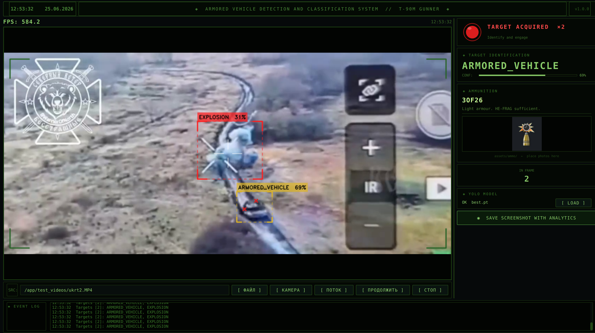
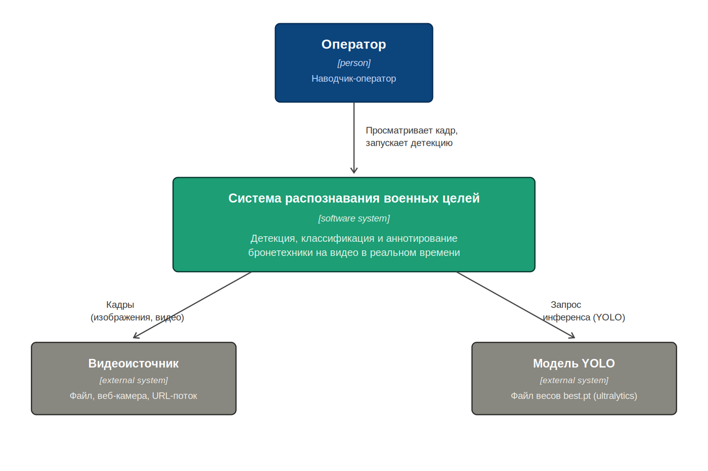
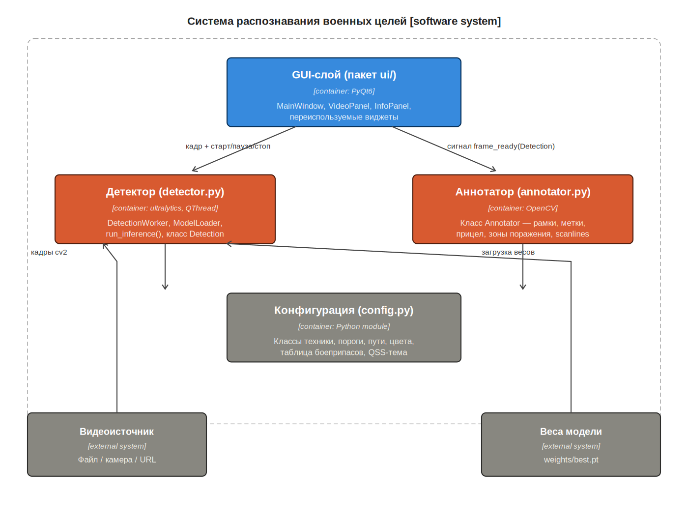
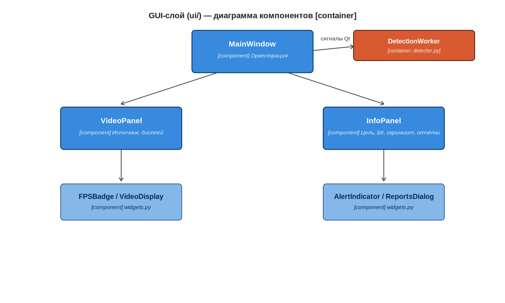

# Автоматическое распознавание военных целей

Десктопное приложение для детекции и классификации бронетехники на видео в реальном времени. Использует модель YOLO (Ultralytics)


---

## Содержание

- [Возможности](#возможности)
- [Скриншот интерфейса](#скриншот-интерфейса)
- [Архитектура](#архитектура)
- [Технологический стек](#технологический-стек)
- [Структура проекта](#структура-проекта)
- [Установка на Ubuntu — быстрый старт](#установка-на-ubuntu--быстрый-старт)
- [Установка вручную, шаг за шагом](#установка-вручную-шаг-за-шагом)
- [Запуск без Docker (для разработки)](#запуск-без-docker-для-разработки)
- [Просмотр сохранённых отчётов](#просмотр-сохранённых-отчётов)
- [Тестирование](#тестирование)
- [Возможные проблемы](#возможные-проблемы)

---

## Возможности

- Загрузка видео из файла, веб-камеры или сетевого URL-потока
- Детекция и классификация бронетехники (танки, БТР, артиллерия, грузовики и др.) моделью YOLO
- Автоматический расчёт точки гарантированного поражения цели по геометрии рамки
- Рекомендация типа боеприпаса в зависимости от класса цели
- Счётчик FPS с цветовой индикацией, индикатор обнаружения цели
- Сохранение скриншота кадра (JPG) и тактического отчёта (TXT) одной кнопкой
- Встроенный просмотрщик сохранённых отчётов — работает одинаково и при обычном запуске, и в Docker-контейнере
- Журнал событий с временными метками
- Пауза / продолжение обработки видео без перезапуска

## Скриншот интерфейса



## Архитектура

Архитектура спроектирована по модели **C4** (Context → Containers → Components) и реализована как трёхслойная монолитная система: слой представления (`ui/`), слой бизнес-логики (`detector.py`, `annotator.py`) и общий слой конфигурации (`config.py`). Подробное обоснование выбора архитектурного стиля — в отчёте по курсовому проекту.

**Диаграмма контекста (уровень 1)**



**Диаграмма контейнеров (уровень 2)**



**Диаграмма компонентов (уровень 3)**



## Технологический стек

| Компонент | Технология |
|---|---|
| Язык | Python 3.12 |
| Интерфейс | PyQt6 |
| Компьютерное зрение | OpenCV |
| Детекция объектов | Ultralytics YOLO |
| Многопоточность | QThread, QMutex |
| Контейнеризация | Docker |
| Хранение весов модели | Git LFS |

## Структура проекта

```
automatic_detection_military_targets_yolo/
├── assets/
│   ├── ammo/              # фотографии боеприпасов для информационной панели
│   └── icon.png           # иконка приложения
├── ui/
│   ├── main_window.py     # главное окно, оркестрация всех компонентов
│   ├── video_panel.py     # видеообласть, управление источником
│   ├── info_panel.py      # панель аналитики: цель, боекомплект, статус
│   ├── reports_dialog.py  # встроенный просмотрщик сохранённых отчётов
│   └── widgets.py         # переиспользуемые виджеты (индикаторы, FPS, лог)
├── weights/
│   └── best.pt            # веса модели YOLO (хранится через Git LFS)
├── docs/                   # диаграммы архитектуры для README и отчёта
├── screenshots/            # сюда сохраняются скриншоты и TXT-отчёты (создаётся автоматически)
├── config.py               # единая точка конфигурации — классы, цвета, пороги, пути
├── detector.py              # датакласс Detection, загрузка модели, поток инференса
├── annotator.py              # отрисовка рамок, прицела, зон поражения на кадре
├── main.py                    # точка входа
├── Dockerfile
├── install.sh                  # автоматическая установка одной командой
├── launch-military-detector.sh # запуск приложения в Docker с выводом GUI на хост
├── requirements.txt
├── .gitignore
└── .gitattributes              # настройка Git LFS для весов модели
```

## Установка на Ubuntu — быстрый старт

Если на машине уже есть Docker и Git LFS, всё разворачивается тремя командами:

```bash
git clone https://github.com/drdvz95/automatic_detection_military_targets_yolo.git
cd automatic_detection_military_targets_yolo
chmod +x install.sh && ./install.sh
```

После завершения приложение появится в меню приложений Ubuntu (поиск «Military Detector») и на рабочем столе.

## Установка вручную, шаг за шагом

Если что-то из перечисленного выше не установлено или хочется понимать каждый шаг — вот полная инструкция с нуля.

### 1. Установить Docker

```bash
sudo apt update
sudo apt install -y docker.io
sudo systemctl enable --now docker
sudo usermod -aG docker $USER
```

После этой команды нужно **перелогиниться** (выйти и зайти в систему заново) или выполнить в текущем терминале:

```bash
newgrp docker
```

Без этого шага Docker будет требовать `sudo` перед каждой командой.

### 2. Установить Git LFS

Веса модели (`weights/best.pt`, ~57 МБ) хранятся в репозитории через Git LFS — обычный Git не умеет эффективно работать с такими файлами.

```bash
sudo apt install -y git-lfs
git lfs install
```

### 3. Склонировать репозиторий

```bash
git clone https://github.com/drdvz95/automatic_detection_military_targets_yolo.git
cd automatic_detection_military_targets_yolo
```

Если Git LFS был установлен после клонирования, веса нужно подтянуть отдельно:

```bash
git lfs pull
```

Проверить, что веса скачались правильно (должно быть ~57 МБ, а не ~130 байт):

```bash
ls -lh weights/best.pt
```

### 4. Собрать Docker-образ

```bash
docker build -t military-detector .
```

Сборка занимает несколько минут — устанавливаются системные библиотеки для PyQt6 и Python-зависимости из `requirements.txt`.

### 5. Запустить приложение

```bash
chmod +x launch-military-detector.sh
./launch-military-detector.sh
```

Скрипт сам определяет путь к проекту, поэтому сработает на любой машине без правок.

### 6. (Опционально) Добавить ярлык в меню приложений

```bash
chmod +x install.sh
./install.sh
```

Этот шаг можно выполнить и сразу вместо пунктов 4–5 — `install.sh` сам собирает образ и создаёт ярлык.

## Запуск без Docker (для разработки)

Если нужно отредактировать код и быстро проверить результат без пересборки контейнера:

```bash
python3 -m venv venv
source venv/bin/activate
pip install -r requirements.txt
python main.py
```

## Просмотр сохранённых отчётов

Кнопка **OPEN REPORTS** в правой панели интерфейса открывает встроенное окно со списком всех сохранённых скриншотов и тактических отчётов — с превью кадра и текстом отчёта. Это работает одинаково при обычном запуске и при запуске через Docker, при условии что папка `screenshots/` смонтирована как volume (уже настроено в `launch-military-detector.sh`).

Файлы физически лежат в `screenshots/` в корне проекта на хост-машине — их можно открыть и обычным файловым менеджером.

## Тестирование

Тестирование проводилось по программе и методике испытаний из технического задания. Сводный протокол — в отчёте по курсовому проекту. Кратко:

| № | Тест | Критерий |
|---|---|---|
| 4.1 | Холодный старт | окно ≤ 10 с (≤ 20 с с загрузкой модели) |
| 4.2 | Обработка изображений | ≥ 80% кадров с корректной разметкой, обработка кадра ≤ 100 мс |
| 4.3 | Обработка видео | FPS ≥ 9, индикатор тревоги срабатывает корректно |
| 4.4 | Графический интерфейс | все элементы присутствуют и функциональны |
| 4.5 | Скриншот и отчёт | JPG и TXT создаются и содержат данные |

## Возможные проблемы

**Окно приложения не появляется / ошибка дисплея**
Перед запуском контейнера нужно разрешить ему доступ к X11-сессии хоста — это уже встроено в `launch-military-detector.sh` (`xhost +local:docker`). Если всё равно не работает, проверь переменную `$DISPLAY`:
```bash
echo $DISPLAY
```
Она не должна быть пустой.

**`weights/best.pt` весит около 130 байт, а не ~57 МБ**
Это означает, что подтянулся только LFS-указатель, а не сам файл. Выполни:
```bash
git lfs pull
```

**`docker build` падает на установке системных пакетов**
Если в логе видна ошибка вида `Package ... has no installation candidate` — значит изменился список пакетов в выбранном базовом образе Debian. Нужно посмотреть, под каким именем доступен нужный пакет в текущей версии (`apt-cache search <часть_имени>`), и поправить `Dockerfile`.

**После `git lfs migrate` или `--force` push на другом устройстве конфликт истории**
Если репозиторий клонирован на нескольких машинах, после операций, переписывающих историю (как миграция на LFS), на остальных машинах нужно синхронизировать историю заново:
```bash
git fetch origin
git reset --hard origin/main
```
Это сотрёт локальные изменения на той машине — использовать только если на ней нет несохранённых правок.

---
